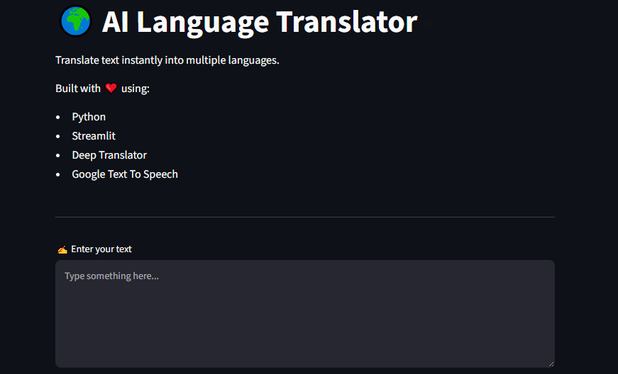
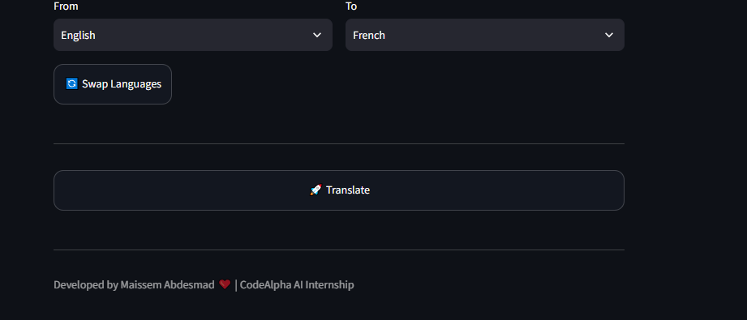
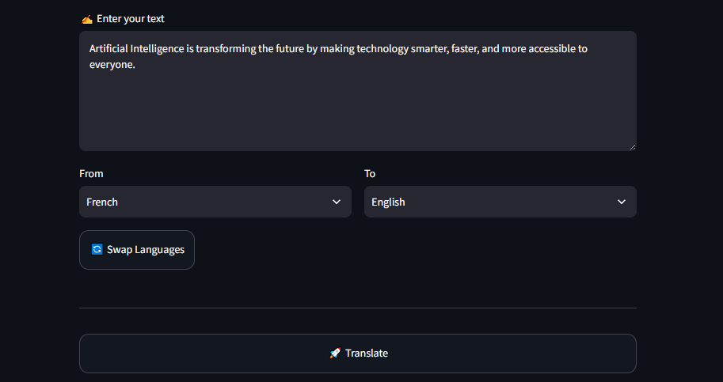
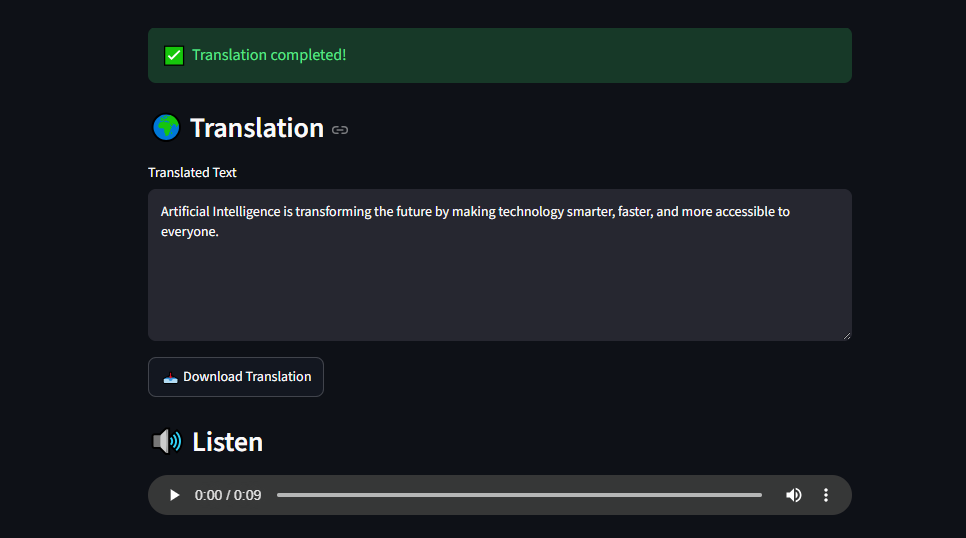

# 🌍 AI Language Translator

A modern AI-powered Language Translator built using **Python**, **Streamlit**, **Deep Translator**, and **Google Text-to-Speech (gTTS)**.

This application allows users to translate text into multiple languages, listen to translated speech, download the translated text, and keep a history of previous translations through a clean and user-friendly interface.

---

# ✨ Features

- 🌍 Translate text into multiple languages
- 🔄 Swap source and target languages
- 🔊 Text-to-Speech (TTS)
- 📥 Download translated text as a `.txt` file
- 🕘 Translation history
- ⚠️ Error handling
- 🎨 Modern and responsive user interface

---

# 🛠 Technologies Used

- Python
- Streamlit
- Deep Translator
- Google Text-to-Speech (gTTS)

---

# 📷 Screenshots

## 🏠 Home Page



---

## 🎨 User Interface



---

## 🌍 Translation Example



---

## 🕘 Translation History



---

# 🚀 Installation

### 1. Clone the repository

```bash
git clone https://github.com/mabdesamad-gif/LanguageTranslator.git
```

### 2. Navigate to the project folder

```bash
cd LanguageTranslator
```

### 3. Install the required dependencies

```bash
pip install -r requirements.txt
```

### 4. Run the application

```bash
streamlit run app.py
```

---

# 📁 Project Structure

```text
LanguageTranslator/
│
├── app.py
├── README.md
├── requirements.txt
├── .gitignore
├── LICENSE
│
└── screenshots/
    ├── Home-1.PNG
    ├── Home-2.PNG
    ├── translation-1.PNG
    └── translation-2.PNG
```

---

# 🎯 Future Improvements

- 🌐 Support more languages
- 📋 Copy translated text with one click
- 🎙 Speech-to-Text input
- 🤖 AI-powered translation suggestions
- ☁️ Deploy the application on Streamlit Community Cloud

---

# 👩‍💻 Author

**Maissem Abdesmad**

AI & Cloud Engineering Student

**Skills**

- Python
- Artificial Intelligence
- Cloud Computing
- Networking

**GitHub**

https://github.com/mabdesamad-gif

---

# 📜 License

This project is licensed under the **MIT License**.

---

# ⭐ Support

If you like this project, don't forget to ⭐ star the repository and share your feedback.